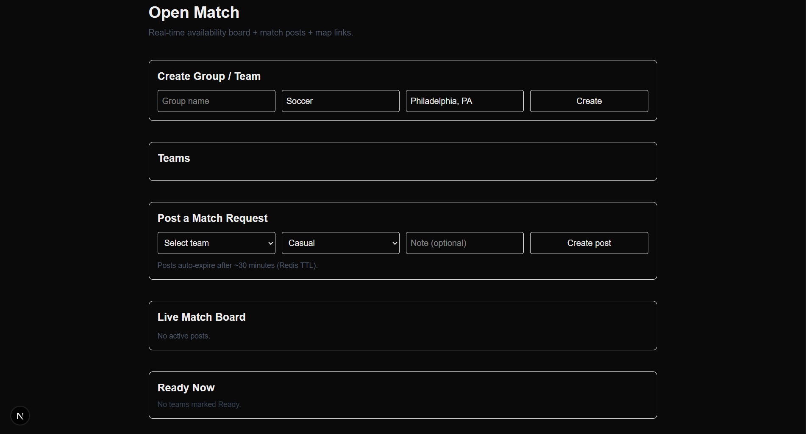

# Open Match 

Open Match is a web application made to allow casual players, friend groups, and
informal teams to find other nearby players or groups for recreational sports matches. The
platform functions as a live availability board where users signal that they are ready to play and
find others looking for a match at the same time. Users can create a profile as an individual or as part of a group, select a sport, skill level,
preferred team size, and general location, and toggle their current availability status being either
Ready, Away, or Offline. When marked as Ready, users/groups can post a short-lived match
request describing the game they want to play based on a fixed selection. This can range from a
casual soccer match to a competitive basketball game. Other nearby users/groups can view and
request to accept these requests. Open Match also displays nearby sports fields depending on game selection chosen.
Fields are informational only and cannot be reserved, but availability notes are provided. Once a
match is accepted, participants are shown the selected field location and can coordinate final
details using external communication.

 

# How to run

## Requirements
- OS: Windows 10+/macOS/Linux
- Docker Desktop
- Python 3.11+
- Node.js 20+

## Run Locally

### 1. Start Postgres + Redis
From the repo root:
```bash 
docker compose up -d
```
To stop containers
```bash 
docker compose down
```
### 2. Run the backend
```bash
cd backend
python -m venv .venv
```

# Windows:
```bash
.venv\Scripts\activate
```
# macOS/Linux:
```bash
source .venv/bin/activate

pip install -r requirements.txt
uvicorn main:app --reload --port 8000
```

### 3. Run the frontend
```bash
cd frontend
npm install
npm run dev
```

Start pgAdmin: 

Windows: 
```bash
docker run -p 5050:80 -e PGADMIN_DEFAULT_EMAIL=admin@example.com -e PGADMIN_DEFAULT_PASSWORD=admin dpage/pgadmin4
```

check docker using:

```bash
docker ps
```
pgAdmin: http://localhost:5050/login

# How to contribute
Follow this project board to know the latest status of the project: [https://github.com/orgs/cis3296s26/projects/28](https://github.com/orgs/cis3296s26/projects/28)  

### How to build
- Use this github repository: ... 
- Specify what branch to use for a more stable release or for cutting edge development.  
- Use InteliJ 11
- Specify additional library to download if needed 
- What file and target to compile and run. 
- What is expected to happen when the app start. 
